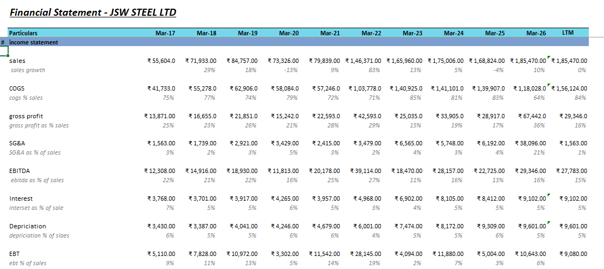
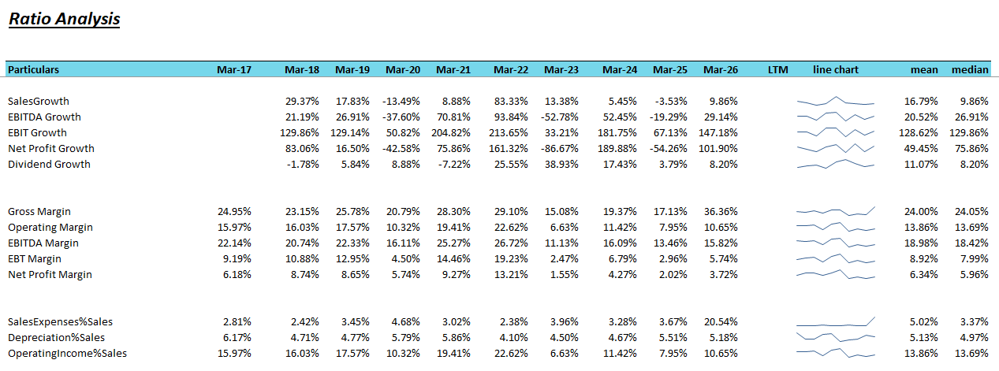
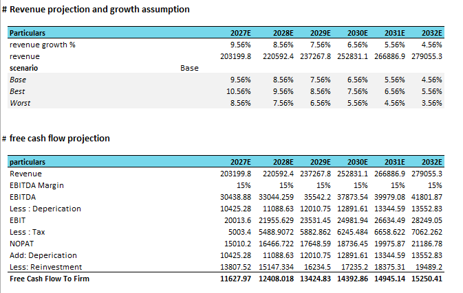
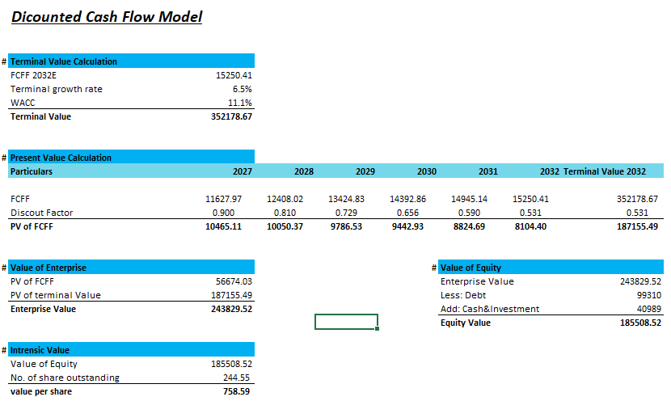
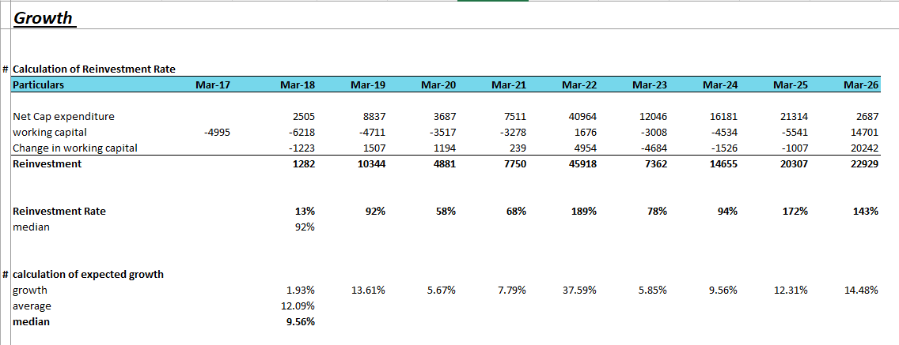
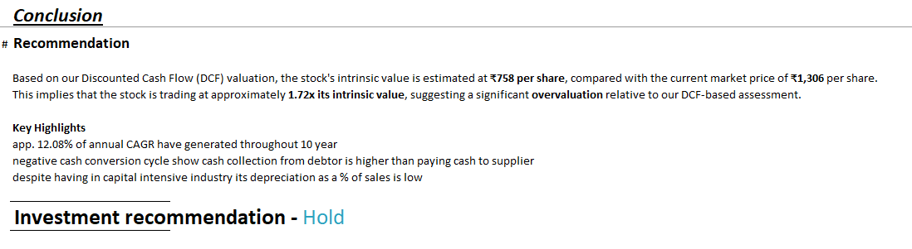

# JSW Steel DCF Valuation & Financial Analysis

## Project Overview

This project presents a Discounted Cash Flow (DCF) valuation and financial analysis of JSW Steel Ltd.

The model analyzes historical financial performance, profitability ratios, growth, reinvestment requirements, projected free cash flow, and intrinsic value using a DCF framework.

The project is designed as a financial analysis / equity research project demonstrating practical valuation and financial modeling skills.

---

## Excel Model

The complete financial model is available here:

**[Download / View Excel DCF Model](JSW_Steel_DCF_Model.xlsx)**

---

## Objectives

- Historical Financial Statements - Summarize ten years of income, balance sheet, cash flows.
- Ratio Analysis - Assess profitability, leverage, and efficiency using key financial ratios.
- DuPont Analysis - Break down return on equity into margin, turnover, leverage.
- Altman Z-Score - Measure bankruptcy risk using a five-factor financial health score.
- Beneish Model - Check whether reported earnings show signs of manipulation.
- Growth - Estimate future growth from reinvestment and return on capital.
- WACC - Calculate overall cost of capital using peer company data.
- FCFF - Forecast six years of free cash flow to firm.
- DCF Model - Discount future cash flows to estimate intrinsic share value.
- Conclusion - Compare intrinsic value with market price and recommend action.
---

## Company

**Company:** JSW Steel Ltd.

**Industry:** Steel

**Valuation Method:** Discounted Cash Flow (DCF)

**Forecast Period:** 2027E–2032E

---

## Analysis Included

### 1. Historical Financial Statements

The model analyzes:

- Revenue recovered. Sales reached ₹185,470 cr in FY26, up 9.9% after a 3.5% fall in FY25. The Q4 FY26 quarter was stronger, with sales of ₹51,180 cr, up about 14% year on year.
  
- Operating profit improved. It stood at ₹29,346 cr, an operating margin of 15.8%. That is better than 13.5% in FY25 but below the 10-year average of 17.9%.
  
- Reported net profit is distorted. Net profit rose to ₹22,316 cr from ₹3,504 cr, mainly because of a one-time other income of ₹18,607 cr, almost all of it in Q4. Excluding this, profit before tax is about ₹10,643 cr. That is still roughly double the prior year's core figure, but far lower than the headline.
  
- Fixed charges take a large share of profit. Interest (₹9,102 cr) and depreciation (₹9,601 cr) together absorb about 64% of operating profit, which reflects the capital-intensive nature of the business.s

---

### 2. Ratio Analysis

The model calculates and analyzes:

- Returns are lower than they appear. Headline ROE is 22.3% and ROCE is 20.3%, but both are lifted by the one-off gain. On the workbook's adjusted basis, ROE is 6.9% and ROCE is 9.9%, against 10-year averages of 14.0% and 13.1%. The DuPont breakdown shows a net margin of 12.0%, asset turnover of 0.73x and an equity multiplier of 1.82x.
  
- Leverage is moderate, but interest cover is thin. Borrowings of ₹99,310 cr are roughly equal to equity (debt-to-equity of about 1.0x). Cash rose to ₹40,989 cr, so net debt is about ₹58,300 cr, or 2.0x EBITDA. Interest coverage is only 2.2x, compared with 6.7x in FY22 and a 10-year average of 2.9x.
  
- Working capital is a strength with one watch point. The cash conversion cycle is negative at about −82 days, because the company takes about 209 days to pay suppliers while collecting from customers in about 22 days. Inventory days have risen from 79 to 105 over the period, so this needs monitoring.
  
- The Altman "Distressed" flag is a model error. The formula multiplies two terms that should be added, and one input uses quarterly instead of annual sales. On a corrected formula the FY26 score would be about 3.4, which is in the safe range. The Beneish M-score of −6.85 shows no sign of earnings manipulation.

---

### 3. Free Cash Flow Projection

The DCF model projects:

- Free cash flow to the firm (FCFF) grows steadily. It rises from ₹11,628 cr in FY27 to ₹15,250 cr in FY32, about 5.6% a year. This assumes revenue growth tapering from 9.6% to 4.6%, a fixed EBITDA margin of 15.0% (below the FY26 level, so conservative) and a 25% tax rate.
  
- Reinvestment absorbs most of the cash. It takes about 92% of NOPAT (net operating profit after tax) each year, which reflects the planned capacity expansion from 35.7 to 51.5 MTPA. As a result, FCFF is only about 36–38% of EBITDA.
  
- Near-term forecasts look realistic. FY26 free cash flow (operating cash flow less capex) was ₹10,610 cr on operating cash flow of ₹25,152 cr, close to the FY27 FCFF estimate. Free cash flow was negative in FY24 (−₹3,469 cr), which shows how sensitive it is to capex cycles.

---

### 4. DCF Valuation

The valuation key points:

- Discount rate and terminal growth. WACC is 11.1%. Cost of equity is 12.4% (risk-free rate 7%, equity risk premium 5%, beta 1.08). Post-tax cost of debt is 6.3%, and the equity-to-debt mix is about 79:21. Terminal growth is 6.5%.
  
- Valuation result. Enterprise value is ₹243,830 cr. After deducting debt of ₹99,310 cr and adding cash of ₹40,989 cr, equity value is ₹185,509 cr, which gives ₹758.6 per share.
  
- Heavy reliance on the terminal value. About 77% of enterprise value comes from the terminal value. The sensitivity table therefore ranges widely, from ₹467 to ₹1,727. Each 0.5-point change in terminal growth moves the value by roughly ₹80 to ₹100.
  
- The market price needs aggressive inputs. Reaching the current price of ₹1,278–1,306 requires a WACC near 9.8% and terminal growth of about 7% or more. A 6.5% terminal growth rate is already at the upper end for a perpetual assumption.
  

---

### 5. Growth & Reinvestment Analysis

The model analyzes:

- Long-term growth overstates the recent pace. Sales CAGR is 14.3% over 10 years and 18.4% over 5 years, but only 3.8% over 3 years. The 83% jump in FY22 flatters the longer periods, so the 3-year figure is a fairer guide to recent momentum.
  
- Growth has not yet earned its cost of capital. Return on capital was 10.1% in FY26 and between 7% and 10% over the last four years, below the 11.1% WACC. Expansion only creates value if returns improve.
  
- Earnings are cyclical. EPS swung between ₹14 and ₹91 over the last five years. The workbook's scenario range is ₹523 (worst) to ₹1,491 (best).

---

## Key Valuation Output

Based on the assumptions used in the model:

| Metric | Value |
|---|---:|
| WACC | 11.1% |
| Terminal Growth Rate | 6.5% |
| Enterprise Value | ₹243,829.52 |
| Equity Value | ₹185,508.52 |
| Shares Outstanding | 244.55 |
| Estimated Intrinsic Value / Share | ₹758.59 |

These figures are outputs of the model and depend on the assumptions used for revenue growth, margins, reinvestment, WACC and terminal growth.

---

## Investment Conclusion

- Valuation gap. The DCF value of ₹758 compares with a market price of ₹1,306, so the stock trades at about 1.7x intrinsic value. That implies roughly 42% downside on the model's assumptions.
  
- Stated recommendation. The workbook says Hold, supported by steady operating cash flow, a negative cash conversion cycle, and a low depreciation-to-sales ratio for the industry. Given the size of the gap, the numbers suggest caution about fresh buying.
  
- Upside drivers. These are stable operating cash flow, higher steel prices, and demand growth (automobile sector estimated at 7.7% CAGR for 2026–30).
  
- Downside risks. These are higher raw material costs (iron ore, coking coal), export and regulatory risk, and execution and funding risk on the capacity expansion.

---

## Skills Demonstrated

- Financial Statement Analysis
- Ratio Analysis
- Equity Research
- DCF Valuation
- Financial Modeling
- Revenue Forecasting
- FCFF Calculation
- Enterprise Value Calculation
- Equity Value Calculation
- Reinvestment Analysis
- Growth Analysis
- Excel Modeling

---

## Tools Used

- Microsoft Excel
- Financial Modeling
- Discounted Cash Flow (DCF)

---

## Disclaimer

This project is created for educational and portfolio purposes.

The valuation is based on assumptions and estimates used in the model. Changes in revenue growth, margins, WACC, terminal growth rate, reinvestment and other assumptions can materially affect the estimated intrinsic value.

This project should not be considered investment advice.

---

## Author

**Utkarsh Singh Marlra**

Finance | Equity Research | Financial Analysis | Valuation
